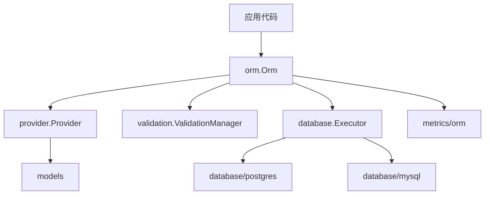

# MagicORM 知识库

本目录只保留和**当前代码实现**一致的正式文档。历史方案、评审记录、阶段性报告和重复入口已移除，不再作为知识库的一部分维护。

项目外层文档入口：
- [README](../README.md)
- [AGENTS](../AGENTS.md)
- [VALIDATION_ARCHITECTURE](../VALIDATION_ARCHITECTURE.md)
- [METRICS_TODO](../METRICS_TODO.md)（本轮 metrics 改造记录）

---

## 1. 使用方式

这套文档遵循三个约定：

- 只描述**当前实现**，不保留已经淘汰的历史方案。
- 设计结论以代码为准，面向后续维护和知识复用，不面向评审过程记录。
- 如果某个能力仍是未来扩展项，会明确写成“当前不支持”或“未来扩展”，而不是保留模糊状态。

---

## 2. 阅读入口

建议按下面顺序阅读：

1. [design-orm.md](design-orm.md)
2. [design-provider.md](design-provider.md)
3. [design-models.md](design-models.md)
4. [design-relation.md](design-relation.md)
5. [design-validation.md](design-validation.md)
6. [design-database.md](design-database.md)
7. [design-remote-provider.md](design-remote-provider.md)
8. [design-metrics.md](design-metrics.md)

常用参考：
- [tags-reference.md](tags-reference.md)
- [type-mapping.md](type-mapping.md)
- [error-codes.md](error-codes.md)
- [testing-guide.md](testing-guide.md)

近期变更说明：
- [release-note-2026-03-remote-update-query.md](release-note-2026-03-remote-update-query.md)
- [technical-note-remote-update-query.md](technical-note-remote-update-query.md)

---

## 3. 按问题找文档

| 你想确认的问题 | 文档 |
|------|------|
| Orm 有哪些公开接口，事务怎么用 | [design-orm.md](design-orm.md) |
| Local/Remote Provider 各自负责什么 | [design-provider.md](design-provider.md) |
| `models.Model` / `Filter` / `ViewDeclare` 是怎么定义的 | [design-models.md](design-models.md) |
| 关系字段怎么判定引用/包含，关系表怎么命名 | [design-relation.md](design-relation.md) |
| 为什么 Insert/Update/Delete 会报验证错误 | [design-validation.md](design-validation.md) |
| 数据库连接、Executor、Pool、DSN 是怎么组织的 | [design-database.md](design-database.md) |
| Remote 的 `Object` / `ObjectValue` / `SliceObjectValue` 怎么工作 | [design-remote-provider.md](design-remote-provider.md) |
| `test/vmi` 下的 remote schema 和运行时实现怎么对齐 | [design-remote-provider.md](design-remote-provider.md) |
| ORM 指标在哪里注册，哪些指标是稳定能力 | [design-metrics.md](design-metrics.md) |
| struct tag 怎么写，`view` / `constraint` 怎么配 | [tags-reference.md](tags-reference.md) |
| Go 类型会映射成什么 models 类型、数据库列类型 | [type-mapping.md](type-mapping.md) |
| `cd.Error` 的 code 和本项目里的错误约定 | [error-codes.md](error-codes.md) |
| `go test ./...` 为什么会因为数据库环境失败，应该怎么分层执行测试 | [testing-guide.md](testing-guide.md) |
| 这轮 remote/update/query 改了什么，使用方需要关注什么 | [release-note-2026-03-remote-update-query.md](release-note-2026-03-remote-update-query.md) |
| 这轮 remote/update/query 为什么这么改，代码语义是什么 | [technical-note-remote-update-query.md](technical-note-remote-update-query.md) |

---

## 4. 文档清单

| 文档 | 作用 |
|------|------|
| [design-orm.md](design-orm.md) | Orm 对外接口、事务模型、CRUD 路径、限制 |
| [design-provider.md](design-provider.md) | Provider 接口、Local/Remote 分工与入口语义 |
| [design-models.md](design-models.md) | Model、Field、Filter、ViewDeclare、ValueDeclare |
| [design-relation.md](design-relation.md) | 引用/包含关系、关系表、Insert/Update/Delete/Query 语义 |
| [design-validation.md](design-validation.md) | 验证系统四层结构、场景、错误与扩展点 |
| [design-database.md](design-database.md) | Executor、Pool、Config、Builder 相关边界 |
| [design-remote-provider.md](design-remote-provider.md) | Remote Object/ObjectValue/SliceObjectValue、VMI 对齐、helper/filter/codec/runner/builder 行为 |
| [design-metrics.md](design-metrics.md) | ORM 指标、注册方式、当前可用范围 |
| [tags-reference.md](tags-reference.md) | `orm` / `constraint` / `view` 标签语法 |
| [type-mapping.md](type-mapping.md) | Go 类型、models 类型、数据库类型映射 |
| [error-codes.md](error-codes.md) | `magicCommon/def` 错误码与本项目使用约定 |
| [testing-guide.md](testing-guide.md) | 测试分层、数据库切换、推荐执行命令、常见失败含义 |
| [release-note-2026-03-remote-update-query.md](release-note-2026-03-remote-update-query.md) | 本轮 remote/update/query 变更结果、影响面与后续建议 |
| [technical-note-remote-update-query.md](technical-note-remote-update-query.md) | 本轮 remote/update/query 的实现背景、关键语义与稳定约定 |

---

## 5. 架构总览

核心事实：
- `Orm` 是统一入口，负责事务、验证调度、Runner 调用和指标记录。
- `Provider` 负责把本地实体或 remote 对象投影为 `models.Model` / `models.Filter` / `models.Value`。
- `models` 是全库统一抽象，Local 与 Remote 都必须遵守。
- `database/*` 负责 SQL 构造与执行，不直接感知具体业务实体。

---

## 6. 当前边界

- Query 与 BatchQuery 当前**不执行验证**；Insert、Update、Delete 会执行验证。
- 同一 Orm 实例的并发安全由调用方保证。
- 关系表命名固定由 `database/codec` 生成，不支持自定义关系表名。
- Remote 语义以 `provider/remote` 与 `test/vmi` 为准，不单独维护另一套协议文档。

---

## 7. 维护原则

- 新文档优先补进现有主题页，不再恢复 `archive/`、评审清单或重复入口。
- 如果某个主题已经能由现有页面表达清楚，优先补索引和交叉引用，而不是再拆新文件。
- 文档引用代码语义时，应尽量写“当前行为”和“边界条件”，避免写具体测试覆盖率、阶段性统计和临时修复过程。
