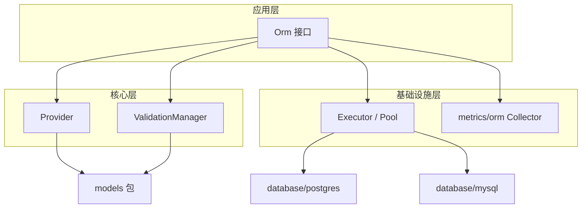

# MagicORM 设计文档

本目录为 MagicORM 的**整理设计**与**按功能块拆分的设计文档**入口。文档基于当前代码实现整理，用于准确描述已实现能力、与 README/现有文档的差异，以及实现核对清单。

**项目文档**：[README](../README.md) | [AGENTS](../AGENTS.md) | [VALIDATION_ARCHITECTURE](../VALIDATION_ARCHITECTURE.md) | [METRICS_TODO](../METRICS_TODO.md)

---

## 1. 整理设计说明

### 1.1 目标

- 准确描述各模块的接口、行为与数据流。
- 标出与 README/现有文档的**不一致**和**遗漏**。
- 为后续核对「缺陷与遗漏」提供检查清单。

### 1.2 阅读对象

- 开发与维护人员：理解实现边界与设计决策。
- 文档维护者：同步 README 与实现。
- 测试与代码审查：按清单逐项核对。

### 1.3 文档结构

设计文档分为**总览**与**功能块文档**两类：

| 类型 | 文档 | 说明 |
|------|------|------|
| 总览 | 本文档（README.md） | 整理设计说明、架构总览、文档索引、数据流概览、参考文档 |
| 功能块 | [design-orm.md](design-orm.md) | ORM 核心接口 |
| 功能块 | [design-provider.md](design-provider.md) | Provider 层 |
| 功能块 | [design-models.md](design-models.md) | 模型与查询（models） |
| 功能块 | [design-validation.md](design-validation.md) | 验证系统 |
| 功能块 | [design-database.md](design-database.md) | 数据库层 |
| 功能块 | [design-metrics.md](design-metrics.md) | 监控与指标 |
| 功能块 | [design-data-flow.md](design-data-flow.md) | 数据流与关键场景 |
| 功能块 | [design-checklist.md](design-checklist.md) | 与现有文档差异及实现核对清单 |
| 维护 | [补充与完善清单.md](补充与完善清单.md) | 基于当前内容可直接补充与修正的条目汇总（所列项均已完成） |
| 归档 | [archive/README.md](archive/README.md) | 历史/已合并设计文档（DESIGN-CONSISTENCY、DESIGN-DATABASE-ORM、UPDATE 关系差异等），仅供查阅 |

---

## 2. 架构总览

### 2.1 模块关系

### 2.2 数据流概览

- **Insert**：应用 → Orm.Insert → validateModel(ScenarioInsert) → 事务 → InsertRunner → Executor.ExecuteInsert / Query。
- **Query**：应用 → Orm.Query(model) → 无验证 → QueryRunner（按主键）→ Executor.Query → 结果回填 Model。
- **BatchQuery**：应用 → Orm.BatchQuery(filter) → 无验证 → QueryRunner(filter) → Executor.Query → 返回 []Model。
- **监控**：Orm 各操作在内部向全局 `ormMetricCollector` 上报，由 `metrics/orm` 的 Provider 注册到 magicCommon/monitoring。

详细时序与事务说明见 [design-data-flow.md](design-data-flow.md)。

---

## 3. 功能块文档索引

| 功能块 | 文档 | 内容摘要 |
|--------|------|----------|
| ORM 核心 | [design-orm.md](design-orm.md) | Orm 接口清单、事务与验证说明、未暴露能力 |
| Provider | [design-provider.md](design-provider.md) | Provider 接口、Local/Remote 实现与使用场景 |
| 模型与查询 | [design-models.md](design-models.md) | Model/Filter 接口、约束、视图（ViewDeclare） |
| 验证系统 | [design-validation.md](design-validation.md) | 四层架构、场景与 Orm 对应、配置 |
| 数据库层 | [design-database.md](design-database.md) | Executor、Pool、Config |
| 监控与指标 | [design-metrics.md](design-metrics.md) | metrics 包、ORMMetricsCollector、magicCommon 注册 |
| 数据流 | [design-data-flow.md](design-data-flow.md) | Insert/Query 时序、事务使用方式 |
| 核对清单 | [design-checklist.md](design-checklist.md) | 与 README 差异、实现核对项与建议 |

---

## 4. 参考文档

- [README](../README.md) — 使用说明与快速开始
- [AGENTS](../AGENTS.md) — 开发与测试指南
- [VALIDATION_ARCHITECTURE](../VALIDATION_ARCHITECTURE.md) — 验证架构
- [METRICS_TODO](../METRICS_TODO.md) — 监控待办与成熟度
