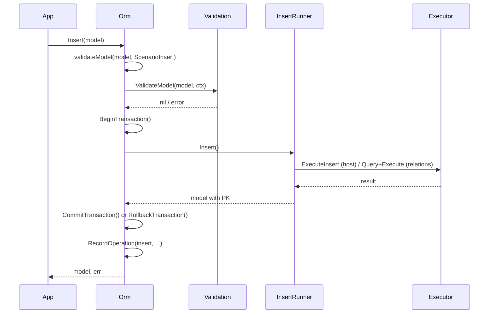
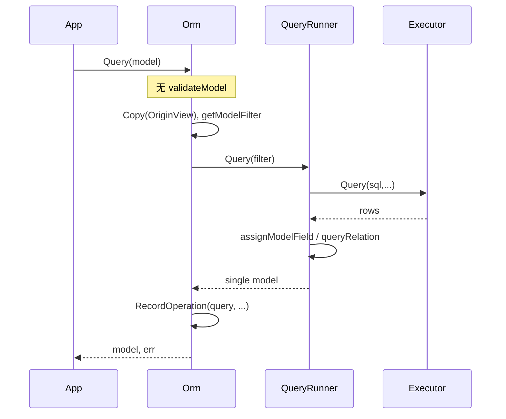

# 数据流与关键场景

**说明**：本文档描述 Orm 核心操作的数据流与事务使用方式。

[← 返回设计文档索引](README.md)

---

## 1. Insert 流程

---

## 2. Query 流程（单条，按主键）

---

## 3. 事务使用方式（当前 API）

Orm 接口定义见 [design-orm.md](design-orm.md)。在同一 Orm 实例上顺序调用，**无 tx 返回值**：

1. `o.BeginTransaction()`
2. `o.Insert(...)` / `o.Update(...)` / `o.Delete(...)` / `o.Query(...)` 等
3. `o.CommitTransaction()` 或 `o.RollbackTransaction()`

与 README 中曾出现的 `tx, err := o1.Begin()`、`tx.Insert(...)` 写法不一致，以当前 API 为准。详见 [design-checklist.md](design-checklist.md)。
