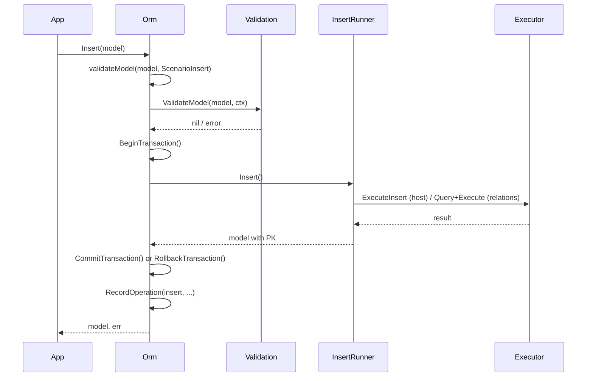
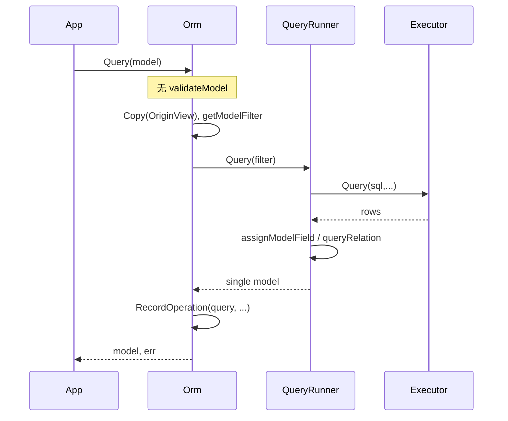

# 数据流与关键场景

**说明**：本文档描述 Orm 核心操作的数据流与事务使用方式。

[← 返回设计文档索引](README.md)

---

## 1. Insert 流程

---

## 2. Query 流程（单条，按主键）

---

## 3. 事务使用方式（当前 API）

Orm 接口定义见 [design-orm.md](design-orm.md)。在同一 Orm 实例上顺序调用，**无 tx 返回值**：

1. `o.BeginTransaction()`
2. `o.Insert(...)` / `o.Update(...)` / `o.Delete(...)` / `o.Query(...)` 等
3. `o.CommitTransaction()` 或 `o.RollbackTransaction()`

与早期 README 示例中出现的 `tx, err := o1.Begin()`、`tx.Insert(...)` 写法不一致，以当前 API 为准。旧示例仅保留在归档文档中用于对比，当前文档与 README 已统一为 `BeginTransaction()/CommitTransaction()/RollbackTransaction()` 模式，详见 [design-checklist.md](design-checklist.md)。

---

## 4. 错误处理与回滚（评审 FLOW-001）

- Insert/Update/Delete 在事务内执行时，任一步骤失败应返回错误并由调用方决定 `RollbackTransaction()`；Runner 内部不自动回滚，由 Orm 层或应用层在收到非 nil 错误后回滚。上文的 Insert/Query 时序图以**成功路径**为主；失败时 Orm 返回非 nil `*cd.Error`，调用方应在同一 Orm 实例上调用 `RollbackTransaction()` 结束事务。
- 错误码与类型见 [error-codes.md](error-codes.md)。

---

## 5. 关联操作流程（评审 FLOW-004）

- 关联表的 Insert/Update/Delete 流程（含引用关系与包含关系、关系表与对端实体的写入顺序）在 [design-relation.md](design-relation.md) 中说明，本文档不再重复。Query 时关联加载见 design-relation 第 7 节与 [archive/QUERY-SLICE-SEMANTICS-FIX.md](archive/QUERY-SLICE-SEMANTICS-FIX.md)（slice 的 nil/[] 语义）。

---

## 6. 批量操作（评审 FLOW-003、FUNC-003）

- 当前 Orm 接口仅提供 **BatchQuery**（按 Filter 批量查询）与 **Count**，**未提供** BatchInsert、BatchUpdate、BatchDelete。若业务需要批量写，需在应用层循环调用 Insert/Update/Delete，或在事务内组合调用。**需澄清**：是否有计划在 Orm 层提供 BatchInsert/BatchUpdate/BatchDelete 及事务语义，见 [需澄清信息.md](需澄清信息.md)。
